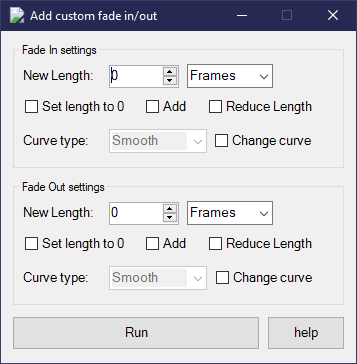

# CustomFades
Vegas Pro script for adding fade in/out to selected media

### Info:  
You can set the Fade In/Out:  
-Length (in Frames / Seconds) - Default: Frame  
-Curve Type (Fast, Linear, Sharp, Slow, Smooth) - Default: Smooth  
-Or reduce the current Fade's length  
Press the help button.  
vid: https://www.youtube.com/watch?v=eJtW4jLYJ8I

### Running the script:  
put the file in either  
...\vegas install folder\Script Menu  
or  
...\documents\Vegas Script Menu  
Tools -> Scripting -> Rescan Script Menu Folder -> click on the script name  
You can also add it to the toolbar in Options -> Customize Toolbar

### Building:  
`using Sony.Vegas;` if you have vp13 and below  
`using ScriptPortal.Vegas;` if you have vp14 and above  
The script `CustomFades.dll` is created in \bin\debug\  

### References:  
Project -> Add reference -> Browse -> Your VEGAS install folder -> `ScriptPortal.Vegas.dll` or `Sony.Vegas.dll`

### Known bugs:
`System.IO.FileLoadException` & `System.NotSupportedExtension` for whatever reason
